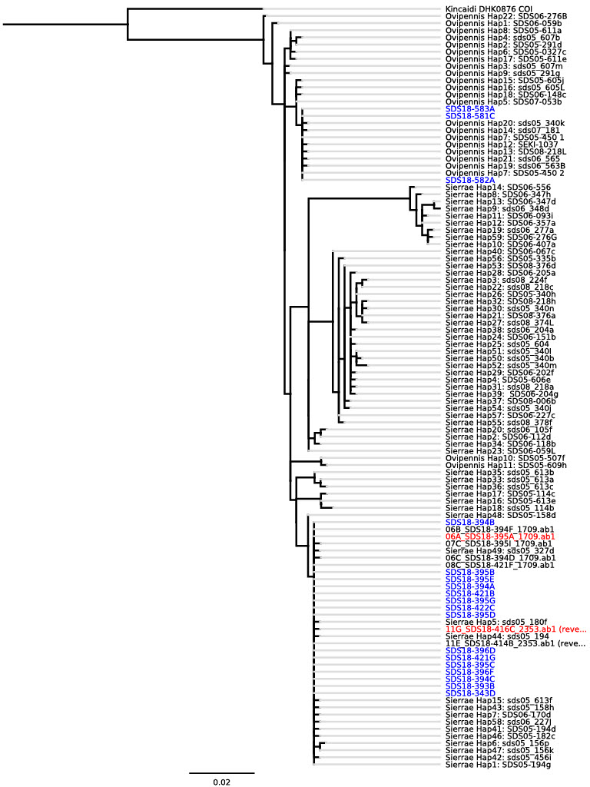

TLDR: Optimizing mutations on a phylogenetic tree

During an evolutionary biology lecture in my sophomore year, I was introduced to phylogenetic trees — graphical representations of the evolutionary paths that species traverse across generations. As species evolve along these branches, they undergo trait changes, diverging into similar species or subspecies. To determine where these changes — the acquisition or loss of a trait—occurred, we apply the Principle of Parsimony. This magical and beautiful rule says that while multiple paths can explain the transition from root to leaf, the one allowing the minimum number of changes is favored.

Fascinated by the simplicity and power of this rule, I wondered: what if we applied this at the genotype level? Tracing DNA sequence mutations is significantly more precise than analyzing phenotypic traits, but it introduces massive computational complexity, especially as the tree grows or the genetic sequences diverge significantly.

To resolve this complexity, I translated the biological tree into a mathematical model. This felt intuitive because the essence of parsimony is, fundamentally, an optimization problem. By viewing the tree as a network of nodes and edges, I framed the challenge of assigning mutations to specific edges as a classic Assignment Problem in Integer Programming.

With these in mind, I reached out to my colleague in my lab whose research centered on building a phylogenetic tree for *Nebria* beetles. He was an expert on polymerase chain reaction (PCR) and had extracted the beetles' DNA sequences, which were then analyzed by an online tool. He generously shared the resulting phylogenetic tree with me, and... the moment of truth! This tree (Figure 1) became my research subject. It looks huge, but it would be magically turned into a mathematical model in a moment.

### Figure 1. The original HUGE phylogenetic tree for Nebria Beetles 

